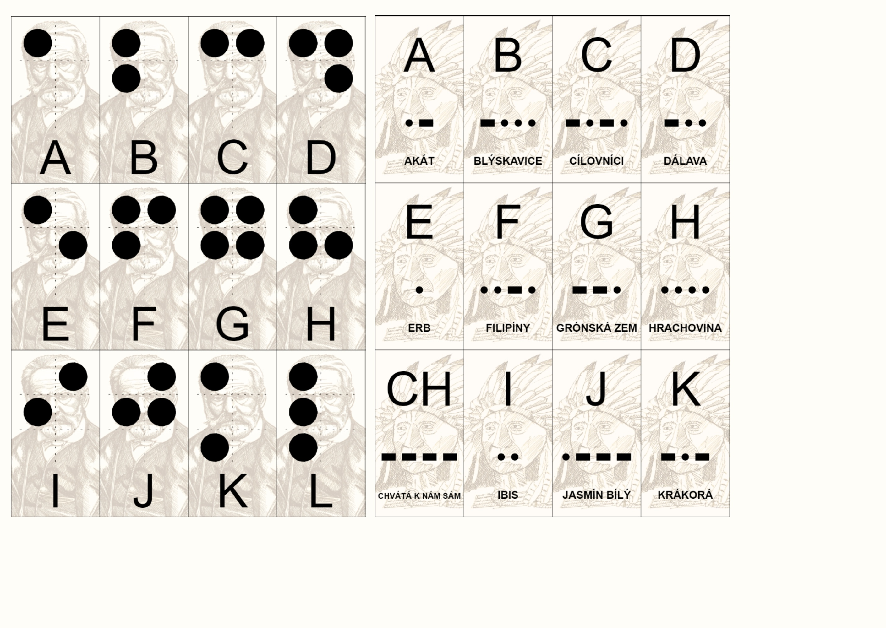

## Braille Cards
Generate two HTML pages for Braille cards containg 12+12 letters with braille dots.

## Morse Cards

Generate three HTML pages for Morse-code cards containong 12+12+12 letters, along with char "CH" with Czech mnemotechnic words.

